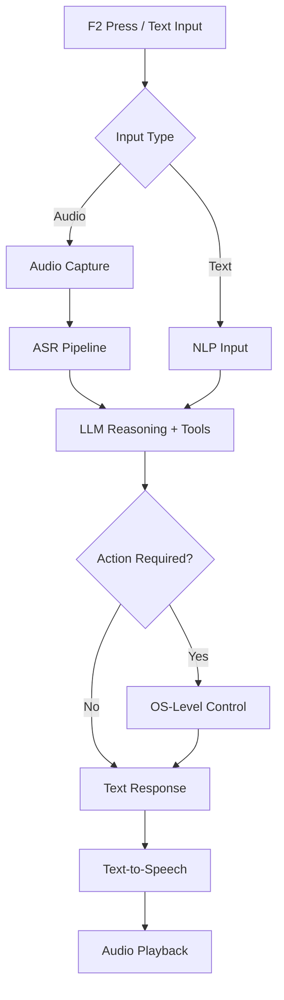

# V1 Desktop Voice Assistant (Push-to-Talk)

A local, push-to-talk desktop AI assistant that listens on demand, understands spoken or typed commands, responds with low-latency speech, and performs basic desktop actions like opening applications or searching. This is V1 — deliberately scoped, safe, and stable.

## 🚀 Project Goals (V1)
This project aims to build a personal AI co-pilot, not a fully autonomous agent.

### ✅ What V1 DOES
- **Push-to-activate**: Uses a hotkey (F2) for listening.
- **Speech Recognition**: English only, optimized for low latency.
- **Text Fallback**: Supports manual text command input.
- **Fast Responses**: Spoken responses with selectable voices.
- **Desktop Control**: Open apps, search files, open URLs, and focus applications.

### ❌ What V1 DOES NOT
- Always-on wake word activation.
- Autonomous workflows or multi-step UI automation.
- File deletion or system modification.
- Continuous screen monitoring.

---

## 🧩 Core Features

### 1️⃣ Push-to-Talk Activation
- Press **F2** to activate listening.
- Press **F2** again or use "cancel" keywords to interrupt.
- No always-on microphone for improved privacy.

### 2️⃣ Speech Recognition (ASR)
- Converts spoken English to text using open-source Hugging Face models.
- Optimized for speed and low-latency interaction.

### 3️⃣ Text-to-Speech (TTS)
- Streaming playback for minimal perceived delay.
- Customizable voice selection via configuration.

### 4️⃣ Desktop Control
- Supported actions:
    - Open applications (e.g., Chrome, Spotify).
    - Search for files or apps.
    - Open URLs in the default browser.
    - Bring specific applications to focus.
- **Constraint**: All actions are explicit, single-step, and non-destructive.

---

## 🏗 Architecture Overview



### Key Design Principles
- **Event-driven**: Not always listening.
- **Modular**: Discrete components for ASR, LLM, TTS, and Control.
- **Safety First**: Explicit tool calls and non-destructive actions.

---

## 📂 Project Structure

```text
your_assistant_project/
├── models/                     # Optional: cached local models
│   ├── asr/
│   ├── llm/
│   └── tts/
├── src/
│   ├── main.py                 # Entry point & state machine
│   ├── audio_input/            # Capture & ASR (mic_listener, asr, vad)
│   ├── nlp/                    # LLM handlers & prompt templates
│   ├── audio_output/           # TTS & playback
│   ├── desktop_control/        # OS-specific actions
│   ├── utils/                  # Logger & configuration
│   └── ui/                     # Optional text UI
├── tests/                      # Unit and integration tests
├── requirements.txt
├── README.md
└── .env
```

---

## 🧠 State Machine (V1)
The assistant transitions between the following states:
`IDLE` ➔ (F2) ➔ `LISTENING` ➔ (Capture) ➔ `THINKING` ➔ (Tool Call) ➔ `ACTING` ➔ `SPEAKING` ➔ `IDLE`

*Interruptions (F2 or cancel keywords) reset the state immediately.*

---

## ⚡ Latency Strategy
Target perceived response time: **600–800 ms**.
- Push-to-talk avoids background noise processing.
- Streaming ASR and TTS playback minimize wait times.
- Early response chunking for faster verbal feedback.

---

## 🛡 Safety & Guardrails
- **Desktop Actions**: Explicit tool invocation only; no free-form execution.
- **Ambiguous Requests**: If intent is unclear, the assistant will state: *"I'm sorry, I am incapable of doing that."* to reduce hallucinations.

---

## 🧪 Example Commands
- “Open Chrome”
- “Search for my resume”
- “Open Spotify”
- “What time is it?”
- “Cancel” / “Forget it”

---

## ⚙ Configuration & Dependencies
- **Settings**: All configurations (models, voices, hotkeys) live in `src/utils/config.py`.
- **Requirements**: Python 3.10+, Hugging Face Transformers, PyAudio/sounddevice, OS automation libraries, and Torch.

---

## 🚧 Known Limitations (V1)
- English only.
- Single-turn commands (no memory persistence).
- No continuous screen awareness or complex UI navigation.

---

## 🛣 Roadmap (V2)
- Wake-word activation.
- Screen understanding and smarter disambiguation.
- Short & long-term memory.
- Multi-step workflows.

---

## 🧠 Philosophy
This assistant is designed as a **reliable co-pilot**, not an autonomous pilot. Stability, safety, and responsiveness are prioritized over complexity.
