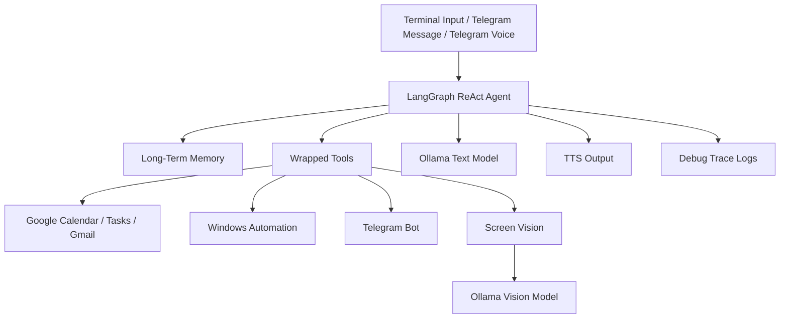

# Tsuzi

<div align="center">


**A local-first desktop assistant with memory, Telegram control, PC automation, and screen vision.**

*Talk to it in the terminal. Message it from Telegram. Let it open apps, manage tasks, send reminders, read the screen, and interact with your desktop.*

</div>

---

## What Tsuzi Can Do Right Now

| Area | Implemented |
| --- | --- |
| Agent | LangGraph ReAct agent with tool calling and multi-step execution |
| Interfaces | Terminal chat and Telegram text/voice interface |
| Memory | Long-term memory with per-query memory refresh |
| Productivity | Alarms, reminders, Google Calendar, Google Tasks |
| Communication | Gmail send/read/search, Telegram notifications |
| PC control | Open/close/focus apps, list windows, screenshots, mouse/keyboard, volume, brightness, lock screen |
| Vision | Screen description, text extraction, find-and-click style UI interaction |
| Debugging | Clear tool-call tracing plus JSONL query/result logs |

---

## Phase Status

- `Phase 1`: LangGraph agent foundation
- `Phase 2`: Long-term memory
- `Phase 3`: Telegram interface and shared assistant runtime
- `Phase 4`: Deterministic Windows PC automation
- `Phase 5`: Screen vision and vision-guided mouse automation

This README documents the project **as currently implemented through Phase 5**.

---

## Experience

```text
You type or send a message
        |
        v
LangGraph agent decides what to do
        |
        +--> calls tools for apps, tasks, mail, reminders, Telegram, PC control
        |
        +--> calls vision tools when UI needs to be located on screen
        |
        v
Tsuzi returns a short assistant response
        |
        +--> optionally speaks it aloud
        +--> logs the full tool trace for debugging
```

---

## Architecture


```mermaid
flowchart TD
    A[Terminal Input / Telegram Message / Telegram Voice] --> B[LangGraph ReAct Agent]
    B --> C[Long-Term Memory]
    B --> D[Wrapped Tools]
    D --> E[Google Calendar / Tasks / Gmail]
    D --> F[Windows Automation]
    D --> G[Telegram Bot]
    D --> H[Screen Vision]
    H --> I[Ollama Vision Model]
    B --> J[Ollama Text Model]
    B --> K[TTS Output]
    B --> L[Debug Trace Logs]
```

---

## Highlights

### Local-first by design
- The main assistant runtime uses Ollama locally.
- Windows automation and screen control happen on-device.
- Voice output is local.

### Actually useful beyond chat
- Set alarms and reminders.
- Manage tasks and calendar events.
- Send yourself notifications on Telegram.
- Open apps, switch windows, type text, press shortcuts.
- Ask what is on screen and click UI elements by description.

### Debuggable
- Debug mode prints only the important execution trail.
- Every query can be logged with tool calls, results, duration, and final output.

---

## Demo Commands

```text
"open chrome and search for LangGraph"
"what windows are open right now?"
"send me a screenshot on Telegram"
"click the search bar and type github"
"read the text on the current screen"
"set an alarm for 7:00 am called workout"
"add a task to finish the README"
"email me the reminder summary"
```

---

## Current Tooling Snapshot

<details>
<summary><strong>Productivity</strong></summary>

- `set_alarm`
- `create_calendar_event`
- `get_upcoming_events`
- `add_task`
- `get_tasks`
- `complete_task`

</details>

<details>
<summary><strong>Communication</strong></summary>

- `send_email`
- `read_emails`
- `search_emails`
- Telegram push notifications for reminders and screenshots

</details>

<details>
<summary><strong>PC Automation</strong></summary>

- `open_app`
- `close_app`
- `list_open_windows`
- `focus_app`
- `minimize_all`
- `take_screenshot_tool`
- `screenshot_to_telegram`
- `click_at`
- `type_text_tool`
- `press_keyboard_key`
- `hotkey_tool`
- `control_volume`
- `control_brightness`
- `lock_screen_tool`
- `get_pc_status`

</details>

<details>
<summary><strong>Vision Tools</strong></summary>

- `find_and_click`
- `find_and_double_click`
- `find_and_right_click`
- `find_and_type`
- `what_is_on_screen`
- `read_text_on_screen`

</details>

---

## Project Structure

```text
src/
├── main.py                    # terminal + Telegram runtime
├── graph/
│   └── agent.py              # LangGraph agent, prompt flow, debug tracing
├── tools/
│   ├── wrapped_tools.py      # tool registry exposed to the agent
│   ├── google/               # Gmail, Calendar, Tasks integration
│   └── pc_automation/        # Windows automation helpers
├── interfaces/
│   └── telegram_bot.py       # Telegram bot interface
├── services/
│   └── send_reminder.py      # reminder delivery via email + Telegram
├── vision/
│   └── screen_vision.py      # screen understanding and element finding
├── memory/
│   └── long_term_memory.py   # persistent memory storage
└── utils/
    └── config.py             # environment-driven configuration
```

---

## Setup

### 1. Create the environment

```powershell
python -m venv .venv
.\.venv\Scripts\Activate.ps1
pip install -r requirements.txt
```

### 2. Install PyTorch separately

```powershell
pip install torch torchvision torchaudio --index-url https://download.pytorch.org/whl/cu121
```

### 3. Make sure Ollama models are available

You already manage models locally. Tsuzi expects:

- a text model for the assistant runtime via `OLLAMA_MODEL`
- a vision-capable model via `VISION_MODEL`

### 4. Configure `.env`

```env
OLLAMA_MODEL=qwen3.5:4b
VISION_MODEL=your_vision_model_here
VISION_NUM_GPU=99

DEBUG_MODE=true

TELEGRAM_BOT_TOKEN=your_bot_token
TELEGRAM_ALLOWED_USER_ID=your_numeric_user_id

GMAIL_ADDRESS=you@gmail.com
GMAIL_APP_PASSWORD=your_app_password
REMINDER_EMAIL=you@gmail.com
```

### 5. Run the assistant

```powershell
python -m src.main
```

---

## Debugging Flow

When `DEBUG_MODE=true`, Tsuzi prints a concise trace like this:

```text
[debug][terminal_text][a1b2c3d4] Query: open chrome and search for github
[debug][terminal_text][a1b2c3d4] Calling tool: open_app | args: {"app_name":"chrome"}
[debug][terminal_text][a1b2c3d4] Tool result: open_app -> Opened chrome, master.
[debug][terminal_text][a1b2c3d4] Calling tool: find_and_click | args: {"description":"search bar"}
[debug][terminal_text][a1b2c3d4] Final response: Done, master.
```

Structured query traces are written to:

```text
logs/agent_traces/agent_trace_YYYYMMDD.jsonl
```

Each record includes:

- query source
- thread id
- tool calls
- tool results
- final response
- duration
- error, if any

---

## Vision Notes

Phase 5 is implemented as **tool-driven vision**, not as a raw multimodal chat UI.

- The text model decides **what** to do.
- The vision module determines **where** on screen the target UI element is.
- Coordinates are converted back to real screen pixels before mouse automation runs.
- Vision import failures are handled gracefully so the assistant does not crash.

---

## Design Choices

<details>
<summary><strong>Why LangGraph?</strong></summary>

It gives you a clean ReAct loop, tool calling, per-thread short-term memory, and a structure that can grow into more autonomous flows without rewriting the assistant from scratch.

</details>

<details>
<summary><strong>Why separate tool wrappers?</strong></summary>

The agent sees a compact, well-documented tool interface while the real implementation details stay isolated in service and automation modules.

</details>

<details>
<summary><strong>Why this debugging style?</strong></summary>

Raw framework traces are noisy. The current debug path is intentionally narrow: show the query, tool calls, tool outputs, final answer, and keep the rest in JSONL logs for later analysis.

</details>

---

## Known Scope

- Windows is the primary supported platform right now.
- The assistant is feature-rich but still evolving, so some flows depend on local desktop state and app availability.
- Vision quality depends on the selected Ollama vision model and the current screen content.

---

## Roadmap Context

The broader roadmap continues beyond this point, but the repository currently reflects completed work **through Phase 5**. The next layers would build on this base rather than replace it.

---

## License

MIT
